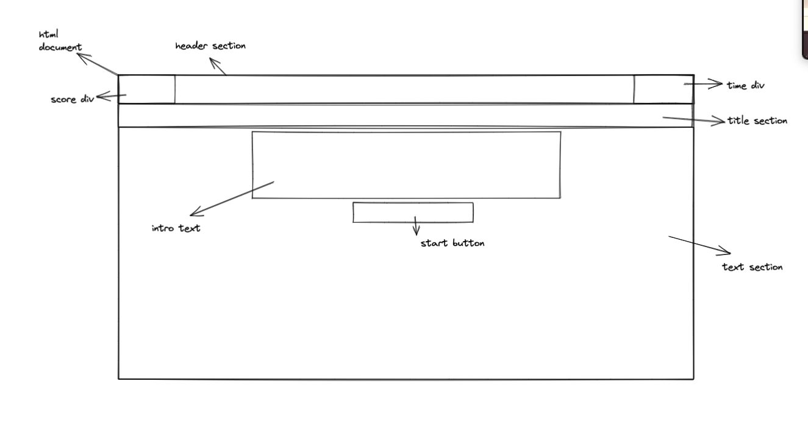
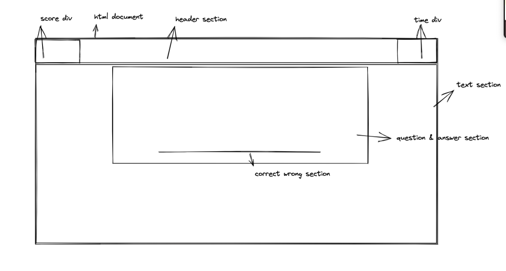
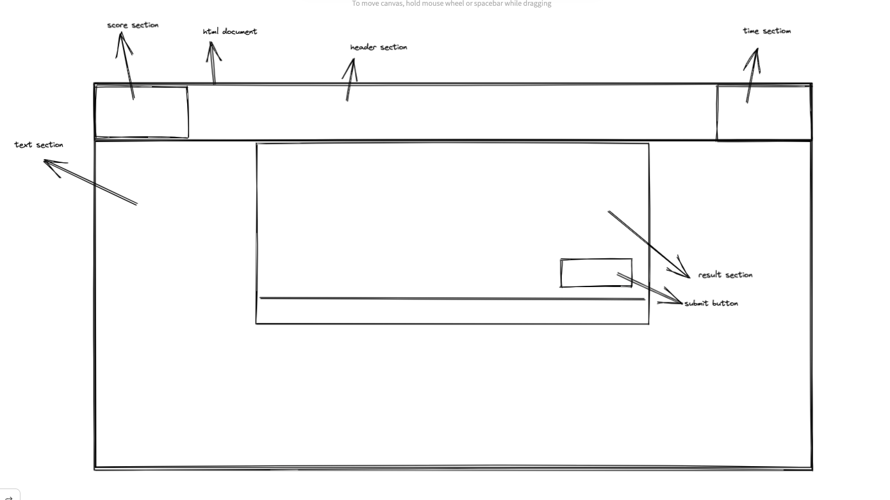
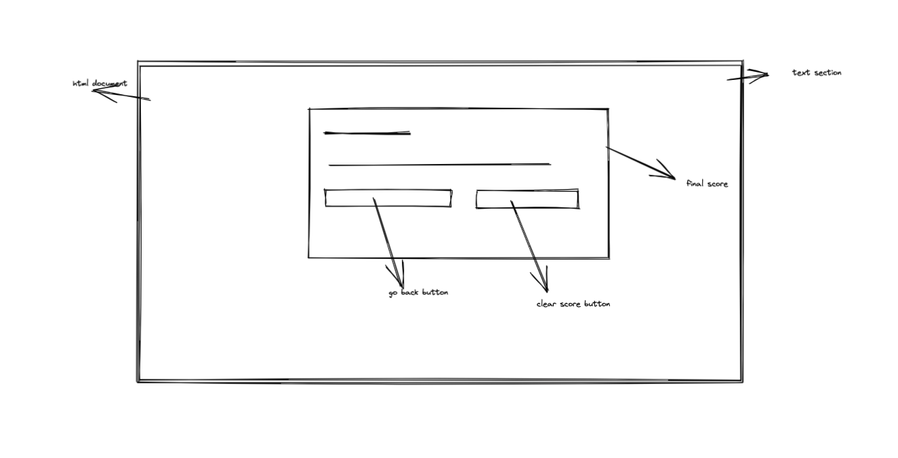

# coding-quiz
## Description
#### What to be done...

Build a timed coding quiz with multiple-choice questions that stores high scores so that one can gauge their progress compared to the peers.
## Things Done

- A logic is written for the start button and by clicking it timer starts and presented with a question.

- When a question is answered the user is presented with another question.

- When a question is answered incorrectly then time is subracted from the clock by 15s.

- When the user is done answering all the questions or when the timer reaches 0 then the game is over.

- When the game is over then the user can save thier initials and scores in a local storage.

## Wireframes Screenshot

## Deployed Screenshot and URL

##
